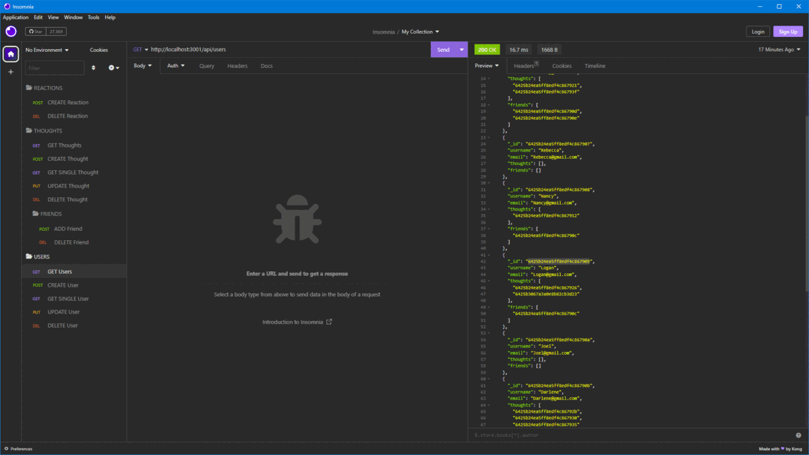

# Social-Network-Api

## About

This is a Back-End Only Application for Use as a `Social-Network-Api` 

## Table of Contents

- [Social-Network-Api](#social-network-api)
  - [About](#about)
  - [Table of Contents](#table-of-contents)
  - [Description](#description)
  - [Preview](#preview)
    - [User Routes:](#user-routes)
    - [User Friend Routes:](#user-friend-routes)
    - [Thought Routes:](#thought-routes)
    - [Thought Reaction Routes:](#thought-reaction-routes)
  - [Installation](#installation)
  - [Walkthrough Video](#walkthrough-video)
  - [Tests](#tests)
  - [License](#license)

## Description

This `Social-Network-Api` is a backend application that would empower users to create accounts, add friends, make original posts, and react to their friends posts. It uses `MongoDB` as our ODM database and the Node Module `Mongoose` as its middleman for helping the server thats utilizing `Express.js` run through `Node.js` to communicate back and forth with `MongoDb`. This application was developed to learn `MongoDB` and `Mongoose` to facilitate getting comfortable with NoSQL style Databases. This Application is a good starting point to flesh out into a full social media app but for starters it could be easily turned into a forum like site very quickly without touching the models too much.

## Preview

The following Gifs Show the Api Routes of the Application and their functionality:

### User Routes:

### User Friend Routes:

### Thought Routes:

### Thought Reaction Routes:

The following image shows what the webpage looks like on load          
  
## Installation

The Application is Not Deployed although you are able to install it locally and mess with the endpoints yourself.

1. To get Started you will need [MongoDb](https://www.mongodb.com/) installed as it is the NoSql database we are using.
2. Clone The Repo Down
3. Create the Database ` socialDB ` in your Mongo shell or Mongo Compass application
4. Run ` npm i ` in your terminal once you cd into the root folder of the application
   1. Make sure after initializing you have the modules mongoose and express installed in your node_modules folder
5. Optionally run ` npm seed ` if you'd like to use the included seeded data for testing, if not skip to step 6
6. Finally run ` npm start ` and the server will be up and booted have fun testing

## Walkthrough Video

The Video Below Showcases Starting the Server, the mongoose models, and all of the Api routes:\
[Walk Through Video](https://drive.google.com/file/d/1SDPs8e-znmxXz2PLlDtsdnneyQdu55OI/view?usp=share_link)

## Tests
  
  No Tests are currently written but using an application like [Insomnia](https://insomnia.rest/) your able to test the API routes and mess with the database on your own
  
## License

